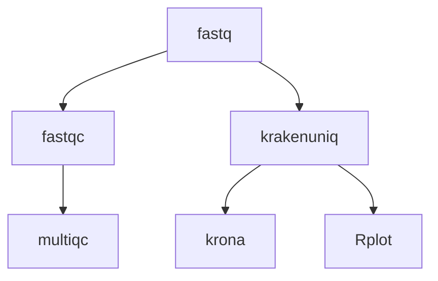

# Marine Omics QC Pipeline


The `moqc` pipeline is intended as an initial step in the analysis of data from marine organisms, particularly those with endosymbionts (corals/giant clams), but also other marine taxa.  In addition to standard short-read QC steps `moqc` uses [krakenuniq](https://github.com/fbreitwieser/krakenuniq) to perform a quick taxonomic classification of reads.  This can help to identify instances of contamination (eg with lab bacteria or human DNA), or potentially identify unexpected reads from commensal eukaryotes such as cryptic barnacles (eg [as in this study](https://github.com/iracooke/Porites_competition/blob/master/07_kraken.md)). 



## Quick Start

0. Build the krakenuniq databases. If you are working on our JCU server, genomics2 this is already done. Otherwise see section below on building the databases.
1. Install [nextflow](https://www.nextflow.io/)
2. Create the sample csv file (example below)
```
sample,fastq_1,fastq_2
1,sample1_r1.fastq.gz,sample1_r2.fastq.gz
2,sample2_r1.fastq.gz,sample2_r2.fastq.gz
```

Paths should either be given as absolute paths or relative to the launch directory (where you invoked the nextflow command)

3. Choose a profile for your execution environment. This depends on where you are running your code. `moqc` comes with preconfigured profiles that should work on JCU infrastructure. These are
	- *genomics2* (HPC nodes without pbs): Use `-profile genomics2`. This is the preferred profile because databases are already installed
	- *HPC* (ie zodiac) : Use `-profile zodiac` (you will need to install databases if you choose this option)

If you need to customise further you can create your own `custom.config` file and invoke with option `-c custom.config`. See [nextflow.config](nextflow.config) for ideas on what parameters can be set.

4. Run the workflow with your samples file
```bash
nextflow run marine-omics/moqc -profile genomics2 -r main --samples <samples.csv> --outdir myoutputs
```

## Outputs

Once the pipeline has finished running you should find the following useful outputs

	- symbiont_plot (A png image with a bar plot showing relative abundance of symbionts across the five main genera. Useful for coral samples)
	- krona (An interactive html page showing the taxonomic breakdown of all classified reads)
	- multiqc (Standard read QC metrics from fastqc)

## Building databases

The krakenuniq databases required for this pipeline are very large and take a lot of compute power to build. We recommend you build these in a central location on a shared computer so that they can be used by multiple users. 

See [databases] for details.


